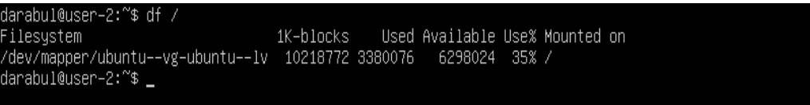

# Отчет по проекту Linux

## Part 1
* чтобы проверить текущую версию системы, воспользуемcя командой `cat /etc/issue`  

       

## Part 2
* чтобы создать нового пользователя, воспользуемся командой `sudo useradd artem`
* чтобы добавить пользователя в группу, воспользуемся командой `sudo usermod -a -G adm artem`
* чтобы проверить имеющихся пользователей, воспользуемся командой `cat /etc/passwd`  

    

## Part 3
* что задать название машине воспользуемся командой `sudo nano etc/hostname` и изменим webserver на user-1, чтобы изменения вступили в силу, воспользуемся командой `sudo reboot`  
    

*   1. чтобы установить временную зону, соответствующую вашему текущему местоположению, нужно сначала выполнить команду `timedateclt list-zones`, с помощью которой мы выбрем временную зону. В нашем случае Europe/Moscow.  
    

    2. теперь устанавливаем временную зону командой  `sudo timedatectl set-timezone Europe/Moscow`
    3. посмотрим результат работы командой `timedatectl`
    

* чтобы вывести названия всех сетевых интерфейсов, воспользуемся командой `ip link show`  

или  
воспользуемся командой `ifconfig -a`
    

    Обратим внимание на интерфейс lo.  
    Что это такое?
    Это виртуальные интерфейс (существует на уровне операционной системы). Он используется для запуска и отладки сетевых программ и серверных приложений на локальной машине.  

* чтобы получить ip адрес от DHCP сервера, нужно, сперва, установить DHCP на вашу систему. Для этого введем следущий набор команд:  
    1. обновим пакетный менеджер командой  
     `sudo apt-get update`
    2. установим dhcp сервер командой  
    `sudo apt-instal isc-dhcp-server -y`  
    3. чтобы получить ip от DHCP сервера воспользуемся командодй  
    `sudo dhclient -v`   
    
    DHCP - Dynamic Host Configuration Protocol. Нужен для того, чтобы автоматически выдавать динамические ip адреса устройствам в сети.

*   1. чтобы узнать внутренний ip адрес(адрес, который нужен, чтобы программы могли взаимодействовать в рамках одного компьютера, используя сетевые протоколы), воспользуемся командой  
    `ping localhost`   
    

    2. чтобы узнать внешний ip адрес (адрес, который используется для выхода в глобальную сеть, бывает статическим и динамическим), воспользуемся командой  
    `curl ifconfig.me`
    
* DNS - это некоторый протокол, который позволяет находить пользовательский запрос через браузеры тип firefox, chrome в интернете. Он сопоставляет IP адрес с некоторым понятным буквенным адресом  
пример : 192.103.104.245 - www.bigbang.com
    1. чтобы вручную настроить ip, gw, dns выполним команду `sudo nano /etc/netplan/00-installer-config.yaml` и установим необходимые значения. Пример настройки конфига на скриншоте:
     
    2. чтобы изменения вступили в силу, воспользуемся командой `sudo netplan apply`  
* Проверим, что настройки сети, которые мы поставили в прошлом пункте сохранились
    1. сначала воспользуемся командой `sudo reboot`, чтобы перезагрузить систему
    2. теперь чтобы проверить сохранились ли наши настройки, воспользуемся командами  
        ```
        ip a
        resolvectl dns
        ip route | grep default
        ```
        
    3. теперь пропингуем удаленные хосты 
    1.1.1.1, 8.8.8.8 и ya.ru   
          
        как видим потери пакетов не обнаружено.

## Part 4
* 1. обновим список пакетов для загрузки командой  
`sudo apt-get update`  
    
  2. обновим установленные пакеты командой  
  `sudo apt-get upgrade`  
  3. введем эту команду повторно, убеждаемся что все обновилось 
    

## Part 5
* sudo - это программа для системного администрированния UNIX систем. Основная идея - это дать пользователям как можно меньше прав, но достаточных для выполнения поставленных задач
* 1. дадим права sudo пользователю artem с помощью команды  
`sudo usermod -aG sudo artem`  
и проверим, что artem получил права sudo, командой `id artem`
    
    2. чтобы поменять пользователя, воспользуемся командой `su artem`
    3. используем команду `sudo nano /etc/hostname` и меняем значение user-1 -> user-2
    4. чтобы изменения вступили, перезагрузим систему командой
    `sudo reboot`
    

## Part 6
* 1. чтобы вывести текущее время, воспользуемся командой `timedatectl`
  2. проверим синхронизацию времени командой `timedatectl show`
  

## Part 7
* чтобы установить текстовые редакторы воспользуемся командой  
`sudo apt-get install vim nano joe`

* 1. - создадим текстовый файл командой `nano test_nano.txt`
     - в открывшемся редакторе nano напишем свой ник 
     - чтобы сохранить изменения воспользуемся сочетанием клавиш CTRL + S
     - чтобы закрыть файл воспользуемся сочетанием клавиш CTRL + X
    
  2. - создаем текстовый файл командой `vim test_vim.txt`
     - в открывшемся редакторе vim пишем свой ник
     - чтобы сохранить изменения и выйти, воспользуемся клавишей ESC, и в командной строке напишем :qw
     
  3. - создаем текстовый файл командой `joe test_joe.txt`
     - в открывшемся редокторе joe пишем свой ник 
     - чтобы сохранить изменения и выйти, воспользуемся сочетанием клавиш CTRL + K + X
     

* 1. - откроем имеющийся текстовый файл командой `nano test_nano.txt`
     - вписываем туда `21 School 21`
     - выходим без сохранения изменений с помощью сочетания клавиш CTRL + X, а после нажимаем клавишу N 
     
  2. - откроем имеющийся текстовый файл командой `vim test_vim.txt`
     - вписываем туда `21 School 21`
     - чтобы выйти без сохранения изменений, перейдем в командный режим, нажав клавишу ESC и вписав в командную строку `q!` 
     
  3. - откроем имеющийся текстовый файл командой `joe test_joe.txt`
     - вписываем туда `21 School 21`
     - выходим без сохранения изменений с помощью сочетания клавиш CTRL + C, а после нажимаем клавишу Y
     

* 1. - откроем имеющийся текстовый файл командой `nano test_nano.txt`
     - вписываем туда `rockguy crockgruy`
     - чтобы осуществить поиск без изменения, воспользуемся сочетанием клавиш CTRL + W, в открывшейся строке записываем строку, которую хотим найти, нажимаем клавишу ENTER
     - чтобы осуществить посик с заменой, воспользуемся сочетанием клавиш ALT + R, в открывшейся строке записываем строку, которую хотим заменить, после в новой открывшейся строке записываем строку, на которую хотим заменить
     
     
     
     
  2. - откроем имеющийся текстовый файл командой `vim test_vim.txt`
     - вписываем туда `rockguy crockgruy`
     - чтобы осуществить поиск без изменений, переходим в командный режим, а дальше вписываем в командую строку `/guy` 
     - чтобы осуществить поиск с изменениями, переходим в командный режим, а дальше вписываем в командную строку `:s/crock/guy`
     
     
  3. - откроем имеющийся текстовый файл командой `joe test_joe.txt`
     - вписываем туда `rockguy crockgruy`
     - чтобы осуществить поиск без замены, воспользуемся сочетанием клавиш CTRL + K + F, и в предложенной строке нажмем на клаву I
     - чтобы осуществить поиск с заменой, воспользуемся сочением клавиш CTRL+K+F, и в предложенно окне нажмем на клавишу R
     
     


## Part 8
* чтобы установить службу sshd, воспользуемся командами:   
`sudo apt-get install ssh`  
`sudo apt install openssh-server`
* чтобы добавить службу в автозагрузку системы воспользуемся командой  
`sudo systemctl enable ssh.service`
* чтобы поменять порт на 2022, воспользуемся командой  
`sudo nano etc/ssh/sshd_config`

* чтобы проверить, что наша служба находится в автозагрузке, воспользуемся командой 
`ps aux | grep sshd`

    Опция `a` указывает ps вывести на дисплей процессы всех пользователей, за исключением тех процессов, которые не связаны с терминалом и процессами группы лидеров.  

    В `u` — подставки для ориентированных на пользователя формате, который обеспечивает подробную информацию о процессах.  

    Опция `x` в ps перечисляет процессы без управляющего терминала. В основном это процессы, которые запускаются во время загрузки и работают в фоновом режиме.

* перезагружаем систему командой `sudo reboot`
* введем команду `netstat -tan`

  - netstat - это утилита, которая позволяет выводить на экран состояние TCP соединений, число сетевых интерфейсов и сетевую статистику по протоколам.
   Зачем использовать? 
   Чтобы находить и устранять проблемы в сетевых соединениях и мониторить их производительность  
   `-t - отобразить только активные TCP-соединения`  
   `-a - отобразить список прослушивающих и непрослушивающих сокетов`  
   `-n - вывод будет осуществляться в символической форме. К примеру localhost:domain отображаться как на 127.0.0.53`  
    Proto - Протокол (tcp, udp, raw),используемый сокетом.  

    Recv-Q - Счётчик байт не скопированных программой пользователя из этого сокета.  

    Send-Q - Счётчик байтов, не подтверждённых удалённым узлом.  

    Local Address - Адрес и номер порта локального конца сокета. Если не указана опция --numeric (-n), адрес сокета преобразуется в каноническое имя узла (FQDN), и номер порта преобразуется в соответствующее имя службы.

    Local Address 0.0.0.0 - означает прослушивание на всех устройствах.

    Foreign Address - 
    Адрес и номер порта удалённого конца сокета. Аналогично "Local Address."

    Foreign Address 0.0.0.0 - это означает, что никто не подключился


    State - Состояние сокета. Поскольку в режиме raw нет состояний, а в режиме UDP состояния обычно не испольуются, эта колонка может оставаться пустой.

    LISTEN - Сокет ожидает входящих подключений. Такие сокеты не включаются в вывод, пока вы не укажете опцию `-a`

    TCP — это протокол управления передачей (Transmission Control Protocol). Его задача — управлять отправкой данных и следить за тем, чтобы они были гарантированно приняты получателем. Именно гарантия получения данных и сделала этот протокол таким востребованным.

## Part 9 

* uptime = 14 min - время непрерывной работы   
    user = 1 - количество авторизованных пользователей  
    load average - общая загрузка системы. Она показывает среднее использование ресурсов процессора на протяжении времени.   
        - 0,10 - средняя нагрузка в течение 1 минуты   
        - 0,12 - средняя нагрузка в течение 5 минут  
        - 0,11 - средняя нагрузка в течении 15 минут  
    Tasks = 101 - общее число процессов   
    %CPU(s) - загрузка CPU в %   
        - 0,0 us - пользователями  
        - 0,3 sy - системой   
    MiB Mem - память   
        - 3920,2 total - используется  
        - 3034,5 free -  свободная   
    PID = 1 - занимает больше всего памяти (столбец  %MEM)  
    PID = 1585 - занимает больше всего процессорного времене (столбец TIME+)


* отсортированному по PID, PERCENT_CPU, PERCENT_MEM, TIME


  

    отфильтрованному для процесса sshd
      
    с процессом syslog, найденным, используя поиск  
      
    с добавленным выводом hostname, clock и uptime  
    

## Part 10
- название жесткого диска = /dev/sda  
- размер жесткого диска = 15 GiB  
- количество секторов = 31457280  
- размер swap = отсутствует 


## Part 11
*   - размер раздела = 10218772  
    - размер занятого пространства = 3380076 
    - размер свободного пространства = 6298024
    - процент использования = 25 
    - единица измерения = Kbytes
    

*   - размер раздела = 9,8
    - размер занятого пространства = 3,3
    - размер свободного пространства = 6,1
    - процент использования = 35
    - единица измерения = Gbytes
    - тип файловой системы = ext4
    

## Part 12
* Вывести размер папок /home, /var, /var/log (в байтах, в человекочитаемом виде)


* Вывести размер всего содержимого в /var/log (не общее, а каждого вложенного элемента, используя *)


## Part 13
* чтобы установить утилиту, воспользуемся командой `sudo apt-get install ncdu`  

    - размер папки /home 
    
    - размер папки /var
    
    - размер папки /var/log
    

## Part 14 
* время последней успешной авторизации: 14:29:45  
  имя пользователя:  darabul  
  метод входа в систему: login  


* - перезапустим службу sshd командой   
`sudo systemctl restart sshd.service`
  - посмотрим сообщение в логах командой  
  `cat ../../var/log/syslog`


## Part 15 
* чтобы установить синхронизацию времени каждые 2 минуты, воспользуемся командой `crontab -e`

посмотрим работу cron с помощью команды `tail /var/log/syslog`  
видим, что через 2 минуты запустилась синхронизация времени
    
выведем список текущих задач cron командой `crontab -l`  

 
 * удалим все задачи из планировщика cron командой `crontab -r` и проверим, что в нем больше нет записей командой `crontab -l`  
 


  


 